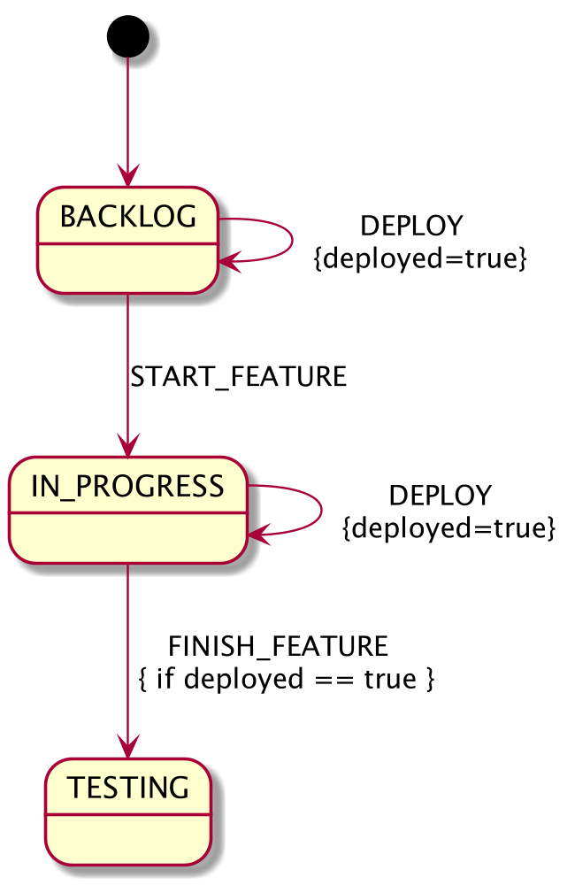

:toc: preamble

# State Machine Utils

image:https://travis-ci.com/jupiter-tools/statemachine-utils.svg?branch=master["Build Status", link="https://travis-ci.com/jupiter-tools/statemachine-utils"]
image:https://codecov.io/gh/jupiter-tools/statemachine-utils/branch/master/graph/badge.svg["", link="https://codecov.io/gh/jupiter-tools/statemachine-utils"]

Tools to improve the Spring State Machine library.

## Dependencies

[source,xml]
----
<dependency>
    <groupId>com.jupiter-tools</groupId>
    <artifactId>statemachine-utils-starter</artifactId>
    <version>0.1</version>
</dependency>
----

## How to resolve available events from a current state of the state machine

If you need to get a list of all available events from the current state then you can use the `StateMachineResolver`. Let’s look at the state machine below. This is a typical example of the Kanban workflow for tasks. Firstly we create a new task in the state `BACKLOG` then we move this task to `IN_PROGRESS` while making an implementation (send event `START_FEATURE`). When our task is done we need to deploy it on the testing environment (event `DEPLOY`), and after that, we can move the task to the state `TESTING` by using an event `FINISH_FEATURE`.

We can move a state machine from `IN_PROGRESS` to `TESTING` only if we already deployed our feature to the testing environment. This rule implements by the guard on the transition (`FINISH_FEATURE`). In this guard, we check the value of the variable `deployed` which will set to true in the DEPLOY transition.

The next code sample shows how to resolve available transitions from the `BACKLOG` state:

[source, java]
----
@SpringBootTest
class StateMachineResolverTest {

	@Autowired
	private StateMachineResolver<States, Events> resolver;

	@Autowired
	private StateMachineFactory<States, Events> factory;

	@Test
	void testResolverWithoutGuard() {
		// Arrange
		StateMachine<States, Events> machine = factory.getStateMachine();
		// Act
		List<Events> availableEvents = resolver.getAvailableEvents(machine);
		// Asserts
		assertThat(availableEvents).containsOnly(Events.START_FEATURE,
		                                         Events.DEPLOY);
	}
}
----

StateMachineResolver evaluates all reachable transitions from the current state of the state machine, in this process tries to check all existed transitions with its guard conditions. And we can find available events in the state `IN_PROGRESS`:

[source, java]
----
@Test
void testResolverWithGuard() {
    // Arrange
    StateMachine<States, Events> machine = factory.getStateMachine();
    machine.sendEvent(Events.START_FEATURE);
    // Act
    List<Events> availableEvents = resolver.getAvailableEvents(machine);
    // Asserts
    assertThat(availableEvents).containsOnly(Events.DEPLOY); <1>
}
----
<1> we don't find the `FINISH_FEATURE` event because our statemachine didn't deploy to the testing environment.